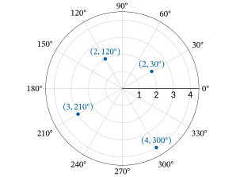
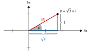

# 8.4 Komplexe Zahlen in trigonometrischer Form

Im letzen Kapitel haben wir die Multiplikation und Division zweier komplexer
Zahlen in der Normalform kennengelernt. Gerade bei »Punktrechnungen« ist jedoch
die sogenannte trigonometrische Form einfacher. In diesem Kapitel werden daher
lernen, eine komplexe Zahl in Normalform in die trigonometrische Form
umzurechnen (und umgekehrt). Dabei lernen wir auch verschiedene Konventionen
kennen. Zuletzt beschäftigen wir uns mit der Multiplikation und Division in
trigonometrischer Form und ihren geometrischen Interpretationen in der Gaußschen
Zahlenebene.

## Lernziele

```{admonition} Lernziele
:class: goals
* Sie können eine komplexe Zahl in der **trigonometrische Form** darstellen.
* Sie können das **Argument** einer komplexen Zahl ausrechnen.
* Sie können eine komplexe Zahl aus der Normalform in die trigonometrische Form
  umrechnen.
* Sie können eine komplexe Zahl aus der trigonometrischen Form in die Normalform
  umrechnen.
* Sie können komplexe Zahlen in trigonometrischer Form **multiplizieren** und
  **dividieren**.
```

## Trigonometrische Form

Die Gaußsche Zahlenebene entspricht einem kartesischen Koordinatensystem, bei
dem jeder Punkt in der Ebene durch seine beiden Koordinaten $(x,y)$ beschrieben
wird. Dabei ist $x$ der Realteil der komplexen Zahl, also $x = \text{Re}(z)$,
und $y$ der Imaginärteil, also $y=\text{Im}(z)$.

Eine Alternative zum kartesischen Koordinatensystem ist das
Polarkoordinatensystem. Im Polarkoordinatensystem werden Punkte in einer Ebene
durch

* Abstand Punkt zum Ursprung und
* Winkel im Verhältnis zur klassischen x-Achse

beschrieben. Zum Beispiel bedeutet die Angabe $(2, 30^{\circ})$ im
Polarkoordinatensystem, dass dieser Punkt einen Abstand von 2 zum Ursprung hat.
Er liegt sozusagen auf einem Kreis um den Ursprung mit Radius $r = 2$. Zeichnet
man jetzt die Verbindungslinie vom Punkt zum Ursprung ein, bildet sie einen
Winkel von $\varphi = 30^{\circ}$ zur klassischen x-Achse. Diesen Winkel nennt
man auch Polarwinkel oder Azimuth.




Komplexe Zahlen in der Gaußschen Zahlenebene können ebenfalls in
Polarkoordinaten dargestellt werden. Zu der komplexen Zahl $z = \sqrt{3} +
\mathrm{i}$ gehören die kartesischen Koordinaten $(\sqrt{3},1)$. In
Polarkoordinaten entspricht das gerade dem obigen Beispiel $(2, 30^{\circ})$. Um
deutlich zu machen, dass es sich um eine komplexe Zahl handelt, werden
allerdings nicht die Polarkoordinaten selbst benutzt, sondern die sogenannte
Polarform. Es gibt zwei Varianten der Polarform. Zunächst betrachten wir die
**trigonometrische Form**:

$$z = 2\cos(30^{\circ}) + 2\sin(30^{\circ})\mathrm{i}.$$

Ein Vorteil dieser Schreibweise ist, dass der Betrag der komplexen Zahl sofort
abgelesen werden kann, weil er dem Radius entspricht:

$$|z| = 2.$$

Wir werden noch sehen, dass der Winkel entscheidend für die Multiplikation,
Division und vor allem auch für das Potenzieren von komplexen Zahlen ist. Um
diese Bedeutung hervorzuheben, wird der Winkel als **Argument** der komplexen
Zahl bezeichnet. Zusammengefasst erhalten wir folgende Definition der
trigonometrischen Form einer komplexen Zahl.

```{admonition} Was ist ... die trigonometrische Form?
:class: note
Die trigonometrische Form ist eine alternative Schreibweise einer komplexen Zahl
$z$. In trigonometrischer Form wird eine komplexe Zahl geschrieben als

$$z = r \, \cos(\varphi) + r \, \sin(\varphi)\, \mathrm{i}.$$

Dabei ist $r$ der Betrag der komplexen Zahl (also $r = |z|$) und $\varphi$ ihr 
Argument.
```

## Umrechnung Normalform und trigonometrische Form

Die Umrechnung von der trigonometrischen Form in die Normalform ist einfach.
Tatsächlich müssen wir ja nur die Kosinus- und Sinuswerte konkret ausrechnen und
jeweils mit dem Betrag multiplizieren. Die komplexe Zahl $z = 2\cos(30^{\circ})+
2 \sin(\varphi) \mathrm{i}$ hat den Realteil

$$\text{Re}(z) = 2 \cos(30^{\circ}) = 2 \cdot \frac{\sqrt{3}}{2}
= \sqrt{3}$$

und den Imaginärteil

$$\text{Im}(z) = 2 \sin(30^{\circ}) = 2 \cdot \frac{1}{2} = 1.$$

Daher ist $z = 2 \cos(30^{\circ}) + 2\sin(\varphi) \mathrm{i}$ in der Normalform
die Zahl

$$z = \sqrt{3} + \mathrm{i}.$$

Die umgekehrte Richtung ist etwas schwieriger, lässt sich aber auch mit
bekannten Formeln aus der Trigonometrie lösen. Dazu zeichnen wir ein
rechtwinkliges Dreieck ein.




Der Betrag der komplexen Zahl $z = \sqrt{3} + \mathrm{i}$ ergibt sich aus dem
Satz des Pythagoras:

$$\textcolor[RGB]{230,0,0}{|z|} = \sqrt{(\sqrt{3})^2 + 1^2} = \sqrt{3 + 1} =
\textcolor[RGB]{230,0,0}{2}.$$

Den Winkel bzw. das Argument $\varphi$ der komplexen Zahl können wir nun über
den Kosinus bestimmen. Der Kosinus ist Ankathete geteilt durch Hypotenuse, also

$$\cos(\varphi) = \frac{\textcolor[RGB]{0,90,148}{\sqrt{3}}}{\textcolor[RGB]{230,0,0}{2}}.$$

Nun wenden wir auf beiden Seiten dieser Gleichung die Umkehrfunktion
Arkuskosinus an:

$$\varphi = \arccos(\cos(\varphi)) = \arccos\left( \frac{\sqrt{3}}{2} \right)
= 30^{\circ}.$$

Für das obige Beispiel hat das gut geklappt. Ein kleines Problem tritt auf, wenn
der Imaginärteil der komplexen Zahl negativ ist. Der Wertebereich der
Arkuskosinus-Funktion ist nämlich $[0, \pi]$ im Bogenmaß oder $[0, 180^{\circ}]$
im Gradmaß. Somit werden nur positive Imaginärteile abgedeckt. Wenn der
Imaginärteil der komplexen Zahl negativ ist und beispielsweise das Argument der
komplexen Zahl $z = \sqrt{3} - \mathrm{i}$ gesucht wird, wird der Winkel im
Uhrzeigersinn angegeben werden und ist somit negativ.

Insgesamt lautet die Formeln zur Berechnung des Betrages $|z|$ für eine
beliebige komplexe Zahl $z = a + b\mathrm{i}$ wie folgt:

$$|z| = \sqrt{a^2 + b^2}.$$

Das Argument $\varphi$ im wird für eine beliebige komplexe Zahl
$z = a + b\mathrm{i}$ folgendermaßen berechnet:

$$ \varphi = \arg(z) =
\begin{cases}
\arccos\left(\frac{a}{|z|}\right), \quad & \text{falls } b\geq 0, \\
* \arccos\left(\frac{a}{|z|}\right), \quad & \text{falls } b < 0.
\end{cases}
$$

Natürlich hätten wir auch Sinus oder Tangens nutzen können, um das Argument der
komplexen Zahl zu berechnen.

```{dropdown} Video "Darstellung komplexer Zahlen" von MathePeter
<iframe width="560" height="315" src="https://www.youtube.com/embed/TSeC_2D8xNs" 
title="YouTube video player" frameborder="0" allow="accelerometer; autoplay; clipboard-write; 
encrypted-media; gyroscope; picture-in-picture" allowfullscreen></iframe>
```

```{dropdown} Video "Polarform" von Mathematrick
<iframe width="560" height="315" src="https://www.youtube.com/embed/KzhWHGoAuK8" 
title="YouTube video player" frameborder="0" allow="accelerometer; autoplay; clipboard-write; 
encrypted-media; gyroscope; picture-in-picture" allowfullscreen></iframe>
```

## Multiplikation und Division in trigonometrischer Form

Als nächstes betrachten wir die Multiplikation und Division zweier komplexer
Zahlen in trigonometrischer Form. Hat die erste Zahl $z_1$ den Betrag $r$ und
das Argument $\alpha$ und die zweite Zahl $z_2$ den Betrag $s$ und das Argument
$\beta$, dann ist das Produkt der beiden komplexen Zahlen

$$z_1 \cdot z_2 = r\cdot s \cdot \left(\cos(\alpha+\beta) +
\sin(\alpha+\beta)\cdot \mathrm{i} \right).$$

Die beiden Beträge werden multipliziert und die beiden Argumente werden addiert.

Für die Division erhalten wir

$$\frac{z_1}{z_2} = \frac{r}{s} \left(\cos(\alpha-\beta) +
\sin(\alpha - \beta)\cdot\mathrm{i} \right).$$

Die beiden Beträge werden dividiert und die beiden Argumente subtrahiert.

## Zusammenfassung und Ausblick

In diesem Kapitel haben Sie gelernt, wie eine komplexe Zahl in trigonometrischer
Form formuliert wird und wie die Umrechnung in die Normalform funktioniert. Wird
die trigonometrische Form verwendet, so sind Multiplikation und Division recht
einfach durchzuführen. Auch in der dritten Darstellungsform für komplexe Zahlen,
der sogenannten Exponentialform, sind diese beiden Rechenoperationen einfach.
Darüber hinaus wird aber auch das Potenzieren und Wurzelziehen erleichtert, so
dass wir im nächsten Kapitel die Exponentialform studieren werden.
